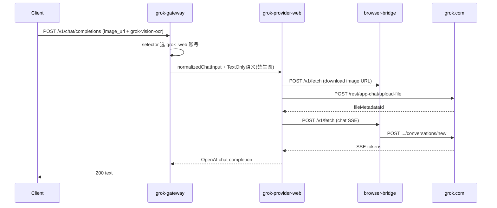

# 39 — grok2api Rust 移植技术总览

最后更新：**2026-08-04**

## 文档体系

| 文档 | 内容 |
|------|------|
| **本文** | 现状、架构决策、能力差距、OCR 规格、与 TNexus 整合 |
| [39a-grok-roadmap.md](39a-grok-roadmap.md) | Phase 0–7 路线图、每阶段 checklist、**验收门禁** |
| [39b-grok-schema.md](39b-grok-schema.md) | 31 表 PG 映射、migration 拆分、Redis key、凭据加密 |
| [39c-grok-test-matrix.md](39c-grok-test-matrix.md) | Go→Rust 单测对照、集成/E2E、门禁脚本 |
| [39d-grok-go-rust-map.md](39d-grok-go-rust-map.md) | 源文件 → crate 模块映射 |
| [../plan.md](../plan.md) §G | 施工总控中的 **Grok 平行主线** |
| [SOURCE.md](SOURCE.md) | 移植源路径与 gptimage 边界 |

## 状态

| 项 | 状态 |
|----|------|
| 规划文档 | ✅ |
| `grok-*` crate | ❌ 未创建 |
| PG `grok_*` 表 | ❌（TNexus 现有 `001`–`009`，Grok 从 `010` 起，见 39b） |
| 生产 grok2api Go | Panda **已停止**（2026-07-28）；worker 依赖外部 `GROK2API_BASE` |
| 与 gptimage 切流 | **独立排期**（[38](38-tnexus-production-cutover.md) / [40](40-tnexus-shutdown-readiness.md) 不阻塞本线） |

---

## 1. 结论

**在 TNexus 内新建平行 Grok 子系统**（`grok2api-rs` + `grok-*` crates），**禁止**塞进现有 ChatGPT `gateway`（PoW/TLS/arkose）或 `upstream` crate。

grok2api 源系统体量：Go 单体 + **三 Provider** + **31 张表** + **22 个命名后台任务** + `accountsync` 批量同步 + Admin API + React 管理端 + 双 sidecar（bridge / signer）。

TNexus 当前仅 worker 在生图阶段 HTTP 调用 `GROK2API_BASE` → `POST /v1/images/generations`，能力覆盖约 **5–10%**。

---

## 2. 移植源（grok2api Go）

路径：`D:\SelfMadeTool\AutoRegister\grokImage\`（[SOURCE.md](SOURCE.md)）

| 维度 | 说明 |
|------|------|
| 语言 | Go 1.26 + Gin；管理端 React 19 + Vite |
| 入口 | `backend/cmd/grok2api/main.go` → `internal/app/application.go` |
| Provider | `grok_build`（OAuth）、`grok_web`（SSO）、`grok_console`（SSO） |
| Web 号池 | **双轨**：Image 四池 + Chat 三池（见 §2.1） |
| Build 号池 | 四池：dispatch / normal / verification / delete |
| 对外 API | `/v1/*` + `/api/admin/v1/*` + `/swagger/*` |
| 后台任务 | 22 个 `startBackground` + 可选 `settings_change_listener`（见 [39a](39a-grok-roadmap.md) §后台任务） |
| 批量同步 | `accountsync`（默认 25 worker，导入后 billing/quota/model catalog） |
| 侧车 | `browser-bridge`（默认 compose）；`signer`（常外置，非默认 compose） |
| 数据 | SQLite 或 PostgreSQL + Redis/Memory runtime |
| Panda（历史） | `/opt/grok2api/`，`data/backend.db` 为 ETL 源 |

### 2.1 Web 双轨号池（纠正「六池混用」表述）

来源：`backend/internal/application/account/web_pool_probe.go`

| 轨 | 池名 | 用途 |
|----|------|------|
| **Image** | dispatch, normal, verification, delete | `imagine` / `grok-imagine*` 生图调度 |
| **Chat** | dispatch, recovery, dead | 对话 / 识图（fast 额度）调度与维护 |

`ResolveWebAcquireLane()`：`imagine` 或 `grok-imagine*` → Image 轨，否则 Chat 轨。

### 2.2 Egress Scope

来源：`backend/internal/domain/egress/egress.go`

| Scope | 用途 |
|-------|------|
| `grok_build` | Build API |
| `grok_web` | Web SSE / 对话 / 刷额度 |
| `grok_web_asset` | 资产下载（可独立 IP） |
| `grok_console` | Console API |
| `grok_web_expand` | **仅并发闸门**；节点回退 `grok_web`，不入 DB CHECK |

Prompt 扩写走 `ScopeWebExpand` + `TextOnly: true`（见 §4 OCR）。

### 2.3 后台任务清单（22 + 条件 1）

`application.go` → `startBackground`：`settings_reconcile`、`billing_reservation_cleanup`、`model_cooldown_cleanup`、`response_ownership_cleanup`、`quota_recovery`、`web_quota_refresh`、`account_analytics`、`credential_refresh`、`statsig_warmup`、`web_quota_startup_catchup`、`model_catalog_startup_catchup`、`build_chat_capability_probe`、`build_dispatch_probe`、`web_dispatch_probe`、`web_maintenance_probe`、`image_dispatch_pin_sync`、`video_recovery`、`video_workers`、`media_cleanup`、`chrome_ticket_pool_sweep`、`image_pipeline_cleanup`、（Redis 时）`settings_change_listener`。

另：启动 `reconcileStartup`；`audits.Start()` 异步审计缓冲；`accountsync` 非 loop 但为号池硬依赖。

---

## 3. TNexus 现状（目标宿主）

| 维度 | 说明 |
|------|------|
| Workspace | 15 crate（`tnexus-api`、`gateway`、`worker`、`upstream`…），**无 `grok-*`** |
| ChatGPT gateway `:8014` | 仅 gptimage 数据面 |
| Grok 生图 | `crates/tnexus-worker/src/upstream.rs`：`GROK2API_BASE` + `GROK_IMAGE_MODEL` |
| Grok 构思（Studio「Grok」文本模型） | **不走 grok2api**：`director_chat` 固定 POST `gptimage_base`；`api_model_name("grok")` → `"gpt-5-mini"` |
| 环境变量链 | `GROK2API_BASE` → 回退 `UPSTREAM_API_BASE` → `http://127.0.0.1:18000`（`worker/main.rs`） |
| API 死配置 | `tnexus-api` 加载 `grok2api_base` 但未使用（`config.rs`） |
| 号池 | ChatGPT `accounts.db` / PG `009`；**无 Grok 账号** |
| UI | Studio 可选 `imageEngine: grok`；**无** Grok 管理页 / OCR UI；**无** `both` 引擎选项（domain 支持） |
| Compose | **无** grok2api 服务；Panda Go 容器已停 → Grok 绘图 job 可能失败 |
| Job PG | `jobs.provider` / `job_results.provider` 含 `grok`；无 `grok_*` 账号表 |

### 3.1 能力差距

| 能力 | grok2api | TNexus |
|------|----------|--------|
| Grok 对话 + 识图 | ✅ `grok-chat-*` + 附件 | ❌ |
| `/v1/responses`、Anthropic、视频 | ✅ | ❌ |
| 生图全链路（PS/SS pipeline、Lite、timeline） | ✅ | ⚠️ 单次 `generations` |
| Web 双轨 + Build 四池 + selector | ✅ | ❌ |
| Admin API（账号 30+ 端点） | ✅ | ❌ |
| `request_audits` | ✅ | ❌ |
| Chrome 票池 | ✅ | ❌ |
| Build / Console Provider | ✅ | ❌ |
| `accountsync` | ✅ | ❌ |
| Web→Build / Web→Console 转换 | ✅ | ❌ |

---

## 4. OCR / 识图技术规格

### 4.1 grok2api **现状**（非 TNexus 拟议）

- **无**独立 OCR 引擎（无 Tesseract 等）。
- **无**对外模型名 `grok-vision-ocr`。
- 识图 = `POST /v1/chat/completions`（或 `/v1/responses`）+ 多模态 `content` + Web 模型（`grok-chat-fast` 等）。
- 流程：`contentTextAndImages` → `prepareChatAttachments`（`upload-file`）→ `fileAttachments` → SSE/非流式文本回复。
- 额度：扣 **fast 对话窗口**，非 imagine。
- 限制：≤8 张图、总 64 MiB；jpeg/png/webp/gif；HTTPS 或 data URI；**不支持** `input_image.file_id`、`input_audio`、`input_file`。
- `TextOnly: true`：**仅用于 prompt 扩写**（`image.go` + `ScopeWebExpand`），设置 `enableImageGeneration=false`。**不是**当前对外识图 API 的开关。
- 普通用户带图请求：`normalizeOpenAIInput` 不设置 `TextOnly` → `enableImageGeneration=true`（可能触发上游生图副作用，移植时需显式治理）。

### 4.2 TNexus **拟议**别名 `grok-vision-ocr`

| 项 | 规格 |
|----|------|
| 路由 | `POST /v1/chat/completions`，`model: grok-vision-ocr` |
| 内部映射 | `grok-chat-fast`（或 `model_routes` 可配） |
| 上游 payload | `enableImageGeneration: false`，`enableImageStreaming: false`；保留 `fileAttachments` |
| 默认 system prompt | 可配置：`提取图中全部可见文字，保持版面顺序；无文字则回复「无文字内容」。` |
| 输出 | 纯文本；可选 JSON schema（`response_format`，Phase 1+） |
| Studio | Phase 7：`/studio` OCR 按钮 → 上述模型（见 [39a](39a-grok-roadmap.md) G7） |
| 验收 | 单图中英文混排 E2E；fast 额度扣减与 Go 对照一致（[39c](39c-grok-test-matrix.md) G-OCR-*） |

### 4.3 识图上游时序（Web）



---

## 5. 目标架构

```text
TNexus workspace
├── tnexus-api :9000
├── gptimage-gateway :8014          # ChatGPT only
├── grok2api-rs :8000               # 【新建】
├── tnexus-worker                   # GROK2API_BASE → grok2api-rs
└── grok-* crates（见 39d）

侧车（不 Rust 化）
├── browser-bridge :8192
└── grok-signer :8788（或外置 URL）
```

### 5.1 Crate 拆分（首期可合并，见 39d）

`grok-domain`、`grok-storage`、`grok-pool`、`grok-pool-index`、`grok-conversation`、`grok-provider-{core,web,build,console}`、`grok-egress`、`grok-gateway`、`grok-audit`、`grok-image-pipeline`、`grok-chrome-ticket`、`grok-admin`、`grok-ops`、`grok2api-rs`。

### 5.2 与现有组件整合

| 组件 | 整合 |
|------|------|
| `gateway` | 保持独立；nginx 可按 `model=grok-*` 分流到 `:8000` |
| `tnexus-accounts-db` | **不动** |
| `tnexus-worker` | `GROK2API_BASE=http://grok2api-rs:8000` |
| `tnexus-storage` | Grok 生图归档 R2（复用现有 pipeline） |
| Redis / PG | 共享实例；key 前缀建议 `grok:`（与 Go `grok2api:` 迁移期可双前缀） |
| `tnexus-api` `grok2api_base` | 删除或用于 Admin 代理 `grok-admin` |

---

## 6. 对外 API 移植范围

### 6.1 `/v1` 推理

| 端点 | 优先级 |
|------|--------|
| `GET /healthz`、`GET /readyz` | P0 |
| `GET /v1/models` | P1 |
| `POST /v1/chat/completions`（含识图） | P1 |
| `POST /v1/images/generations` | P1 |
| `POST /v1/responses` + compact + GET/DELETE | P2 |
| `GET/HEAD /v1/media/images/:id` | P2 |
| `POST /v1/images/edits` | P2 |
| `POST /v1/messages` | P2 |
| `POST /v1/videos/generations` + GET | P3 |

### 6.2 `/api/admin/v1`

账号 CRUD/import、web-pools、probes、models、client-keys、audits、dashboard、settings（含 egress 内嵌）、media、image-timeline、chrome-tickets、system。完整清单见 [39d](39d-grok-go-rust-map.md) §HTTP handlers。

### 6.3 易遗漏模块（须纳入 roadmap）

| 模块 | 源路径 |
|------|--------|
| `accountsync` | `application/accountsync/` |
| Image pipeline v2 | `application/imagepipeline/` |
| Chrome ticket JIT | `application/chrometicket/` + `tools/chrome_ticket_*` |
| Web→Build / Web→Console | `account/handler.go` |
| Redis dispatch 镜像 | `poolindex/redis_mirror.go` |
| 分层 readyz | `transport/http/server.go` Readiness |
| Swagger 契约 | `backend/docs/` |

---

## 7. 路径决策（Agent 开发）

```
仅需 OCR / 识图？
├─ 是 → 方案 A：恢复 Panda Go grok2api（pull+up，禁止 Panda 编译）
│       方案 B：TNexus Phase G1 最小集（grok-gateway + web chat+附件，单池）
└─ 否（号池/Admin/审计/生图全链路）→ Phase G0–G7 全量移植（39a）

与 gptimage :8012 停服：无依赖，可并行。
```

---

## 8. 部署拓扑（终态）

```text
tnexus.relai.asia
  ├─ model=grok-* 或 /v1 经 grok 路由  → grok2api-rs:8000
  ├─ ChatGPT /v1/*                      → gateway:8014
  └─ /*                                 → tnexus-api:9000

grok2api-rs
  ├─ PostgreSQL grok_* 表
  ├─ Redis（grok: 前缀）
  ├─ browser-bridge + signer
  └─ R2（tnexus-storage）
```

**红线**：本地/CI 构建 → GHCR → Panda `deploy.sh`（pull + up）；禁止 Panda 编译（`.cursor/rules/panda-no-remote-build.mdc`）。

草案 compose：`deploy/panda/grok-compose.yml`（待建，见 39a G6）。

---

## 9. 风险与缓解

| 风险 | 缓解 |
|------|------|
| Web Provider 行为遗漏 | Shadow compare + Go 镜像 digest 回滚 |
| 号池 dispatch/pin/ticket 漂移 | 全套探针 + 每日 `account_pool_snapshots` diff |
| Statsig/CF 差异 | 保留 signer + bridge 侧车 |
| 双写 | Phase G6 前禁止 Grok PG 双写 |
| OCR `enableImageGeneration` 误开 | `grok-vision-ocr` 单测锁 payload golden |
| worker 构思假 Grok | 文档化；可选后续 `GROK_DIRECTOR_BASE` |

---

## 10. 决策记录

| 日期 | 决策 | 结论 |
|------|------|------|
| 2026-08-03 | Grok 是否进 `gateway` | **否** |
| 2026-08-03 | Grok 号池存储 | 独立 `grok_*` PG 表 |
| 2026-08-03 | bridge / signer | **侧车**，不 Rust 化 |
| 2026-08-03 | Admin UI | 长期迁入 Next.js；过渡期可双 UI |
| 2026-08-03 | Build/Console | Web 主路径优先 |
| 2026-08-04 | OCR 模型 | **`grok-vision-ocr`** = fast + 禁生图（TNexus 新增，非 Go 现名） |
| 2026-08-04 | `TextOnly` 语义 | Go 现网=扩写；识图须在 Rust 层显式 `enableImageGeneration=false` |

推翻决策：**追加新行**，不覆盖旧行。

---

## 11. 下一步

1. 执行 [39a](39a-grok-roadmap.md) **G0**：`grok-domain` + `migrations/010_grok_schema.sql` + ETL 脚本骨架。
2. 若仅 OCR：评估方案 A（恢复 Go）vs G1 最小 Rust。
3. 每 Phase 合并前跑 `scripts/grok_migration_gate.sh <phase>`（[39c](39c-grok-test-matrix.md)）。
